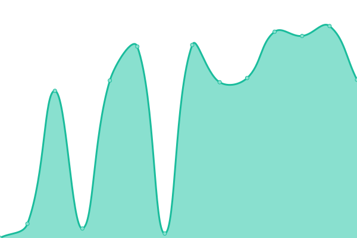

# [📈 Live Status](https://mhmdsyq.github.io/upptime): <!--live status--> **🟩 All systems operational**

This repository contains the open-source uptime monitor and status page for [mhmdsyq](https://mhmdsyq.github.io/upptime), powered by [Upptime](https://github.com/upptime/upptime).

With [Upptime](https://upptime.js.org), you can get your own unlimited and free uptime monitor and status page, powered entirely by a GitHub repository. We use [Issues](https://github.com/mhmdsyq/upptime/issues) as incident reports, [Actions](https://github.com/mhmdsyq/upptime/actions) as uptime monitors, and [Pages](https://mhmdsyq.github.io/upptime) for the status page.

<!--start: status pages-->
<!-- This summary is generated by Upptime (https://github.com/upptime/upptime) -->
<!-- Do not edit this manually, your changes will be overwritten -->
<!-- prettier-ignore -->
| URL | Status | History | Response Time | Uptime |
| --- | ------ | ------- | ------------- | ------ |
|  [Mydin Express](https://mydinexpress.my/hypermart/) | 🟩 Up | [mydin-express.yml](https://github.com/mhmdsyq/upptime/commits/HEAD/history/mydin-express.yml) | 

 2497ms
     
 | 

<a href="https://mhmdsyq.github.io/upptime/history/mydin-express">100.00%</a>
    

|  [Lotus](https://corp.lotuss.com.my/) | 🟩 Up | [lotus.yml](https://github.com/mhmdsyq/upptime/commits/HEAD/history/lotus.yml) | 

 1414ms
     
 | 

<a href="https://mhmdsyq.github.io/upptime/history/lotus">100.00%</a>
    

|  [Aeon](https://www.aeonretail.com.my/) | 🟩 Up | [aeon.yml](https://github.com/mhmdsyq/upptime/commits/HEAD/history/aeon.yml) | 

 452ms
     
 | 

<a href="https://mhmdsyq.github.io/upptime/history/aeon">100.00%</a>
    

|  [Giant](https://www.giant.com.my/) | 🟩 Up | [giant.yml](https://github.com/mhmdsyq/upptime/commits/HEAD/history/giant.yml) | 

 2056ms
     
 | 

<a href="https://mhmdsyq.github.io/upptime/history/giant">100.00%</a>
    

<!--end: status pages-->

[**Visit our status website →**](https://mhmdsyq.github.io/upptime)

## 📄 License

- Powered by: [Upptime](https://github.com/upptime/upptime)
- Code: [MIT](./LICENSE) © [mhmdsyq](https://mhmdsyq.github.io/upptime)
- Data in the `./history` directory: [Open Database License](https://opendatacommons.org/licenses/odbl/1-0/)
